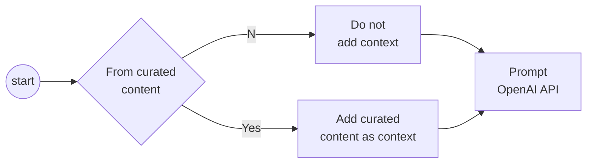
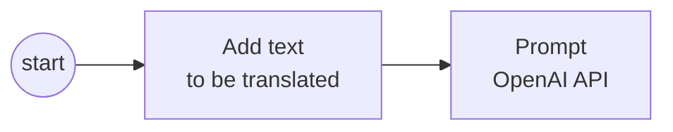
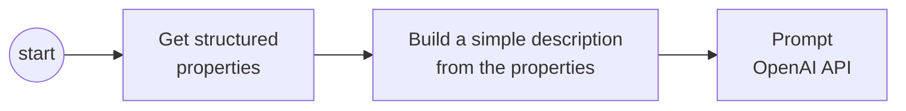

# OpenAI - Common Use Cases

## Recommendation Systems

OpenAI can be used to develop recommendation systems that can suggest products, services, or content to users based on their preferences and behavior.



Examples:

- Without context
```python
prompt = "List the best restaurants in downtown London."
```

- With context
```python
prompt = "List the best restaurants in downtown London.\n[context]\n{list of restaurants from source}"
```

## Language Translation

OpenAI can be used to develop language translation models that can translate text from one language to another.



Examples:

```python
prompt = "Translate the following text from English to Japanes:\n{text}"
```


## Personalization & Content generation

OpenAI can be used to develop personalized content, recommendations, and experiences for users based on their interests and behavior.



Examples:

```python
item = {"make","Ford","model":"Explorer","year":2020,"Color":"red","condition":"excellent"}
item_description = get_item_description(item)
prompt = "Get a full sales description for the following used vehicle:\n" + item_description
```
