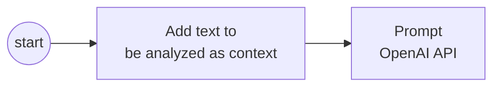
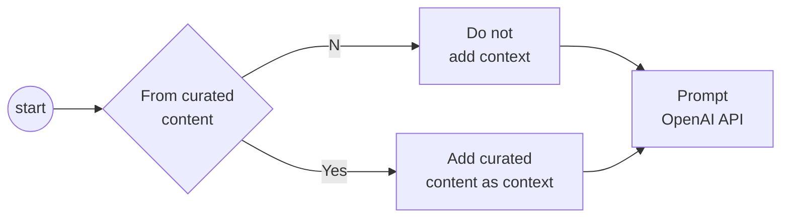
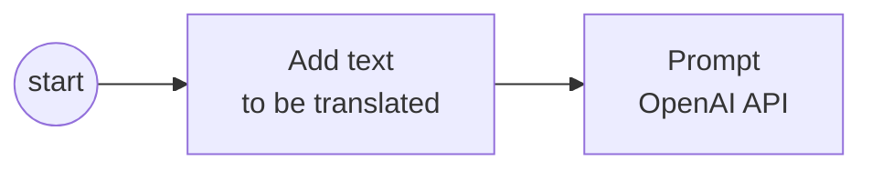
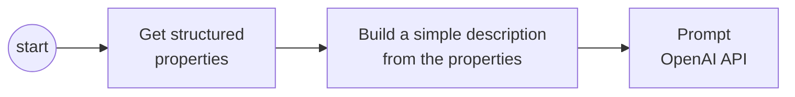
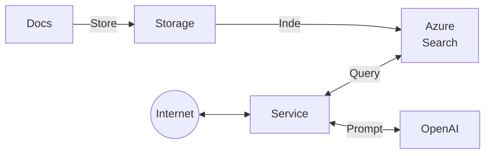

# OpenAI - Common Use Cases

## Common Use Cases

- Summarization & Risk Analysis
- Recommendation system
- Language transation
- Personalization and content generation
- Prompting and complition from your own content
- Image generation
- Image recognition

### Summarization, Risk Analysis, Action Items



Examples:

```python
text = load_text()
prompt = "Summarize and list risks.\n[context]\n{text}"
```


> Prompt:<br/>Summarize and list risks.<br/><br/>Content:<br/>RESIDENTIAL LEASE AGREEMENT<br/>
RENT. The Tenant shall pay to Landlord the sum of $1,500 per month (hereinafter referred to as "Rent") for the duration of the Term of the Lease. The Rent shall be payable on or before every day of the month (hereinafter referred to as the "Due Date"), notwithstanding that the said date falls on a weekend or holiday.<br/>
A. Late Rent. If Rent is not paid within days of the Due Date, the Rent shall be considered past due, and a late fee of a $50 or 5% of the Rent past due shall be applied for every day Rent is late or O occurrence Rent is late.<br/>B. Returned Checks. In the event that a check intended as payment for Rent is dishonored for whatever reason, the same shall be considered as Late Rent with the late fee being payable on the same.<br/><br/>Completion:<br/>Summary:<br/>The residential lease agreement states that the tenant must pay $1,500 per month on or before the due date, with a late fee of $50 or 5% of the rent past due if payment is not made within days of the due date. If a check intended as payment is dishonored, it will also be considered as late rent with the late fee being payable on the same.<br/>Risks:<br/>- Risk of incurring late fees if rent is not paid on time.<br/>- Risk of incurring additional fees if a check intended as payment is dishonored.<br/>- Risk of potential legal action if rent is consistently paid late or not at all.


### Recommendation System

OpenAI can be used to develop recommendation systems that can suggest products, services, or content to users based on their preferences and behavior.



Examples:

- Without context
```python
prompt = "List the best restaurants in downtown London."
```

- With context
```python
list = get_restaurants("London").join("\n")
prompt = "List the best restaurants in downtown London. The answer should come from the following list:\n{list}"
```

### Language Translation

OpenAI can be used to develop language translation models that can translate text from one language to another.



Examples:

```python
source_lang = language("en") # English
target_lang = language("jp") # Japanese
text = load_text()
prompt = "Translate the following text from {source_lang} to {target_lang}:\n{text}"
```

>Prompt:<br/>Translate the following text from English to Spanish: Azure Container Apps is a fully managed environment that enables you to run microservices and containerized applications on a serverless platform. Common uses of Azure Container Apps include:<br/>- Deploying API endpoints<br/>- Hosting background processing applications<br/>- Handling event-driven processing<br/>- Running microservices<br/><br/>Completion:<br/>Azure Container Apps es un entorno completamente administrado que le permite ejecutar microservicios y aplicaciones en contenedores en una plataforma sin servidor. Los usos comunes de Azure Container Apps incluyen:<br/>- Desplegar puntos finales de API<br/>- Alojar aplicaciones de procesamiento en segundo plano<br/>- Manejar procesamiento impulsado por eventos<br/>- Ejecutar microservicios.


### Personalization & Content Generation

OpenAI can be used to develop personalized content and experiences for users based on their interests and behavior.



Examples:

```python
car = {"make","Ford","model":"Explorer","year":2020,"Color":"red","condition":"good"}
car_description = get_car_description(item) # good condition red 2020 Ford Explorer
prompt = "Get a full sales description for a " + car_description
```


>Prompt:<br/>Get a full sales description for a used very good condition red 2020 Ford Explorer<br/><br/>Completion:<br/>This used 2020 Ford Explorer is in very good condition and is a great choice for anyone looking for a reliable and stylish SUV. It has a bold red exterior and a comfortable interior with plenty of room for passengers and cargo. The exterior features a sleek design with a bold grille, LED headlights, and fog lights. The interior is equipped with leather seating, power windows and locks, a power liftgate, and a rearview camera. The 3.5L V6 engine provides plenty of power and the 6-speed automatic transmission ensures smooth shifting. The Ford Explorer also comes with a variety of safety features such as blind spot monitoring, lane keeping assist, and adaptive cruise control. This vehicle is perfect for anyone looking for a reliable and stylish SUV.


### Search Your Own Content

#### Using Azure Search


  
