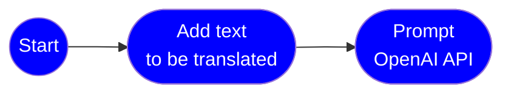

### Language Translation

OpenAI can be used to develop language translation models that can translate text from one language to another.



Jupyter notebook:

- [Translation](https://github.com/msalemor/openai-use-cases/blob/main/notebooks/translation.ipynb)

Examples:

```python
source_language = languageCodes["en"]  # English
target_language = languageCodes["es"]  # Spanish
target_text = mock_get_extract_language("en")

prompt = f'Translate the text from {source_language} to {target_language}.\n[context]\n{target_text}'
```

> Prompt:<br/>Translate the following text from English to Spanish: Azure Container Apps is a fully managed environment that enables you to run microservices and containerized applications on a serverless platform. Common uses of Azure Container Apps include:<br/>- Deploying API endpoints<br/>- Hosting background processing applications<br/>- Handling event-driven processing<br/>- Running microservices<br/><br/>Completion:<br/>Azure Container Apps es un entorno completamente administrado que le permite ejecutar microservicios y aplicaciones en contenedores en una plataforma sin servidor. Los usos comunes de Azure Container Apps incluyen:<br/>- Desplegar puntos finales de API<br/>- Alojar aplicaciones de procesamiento en segundo plano<br/>- Manejar procesamiento impulsado por eventos<br/>- Ejecutar microservicios.
