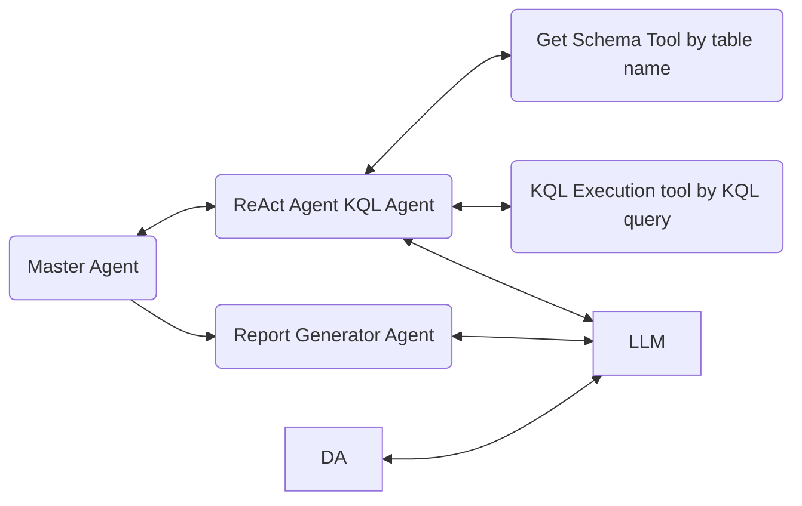

# Agent System

## Description

Upon receive a request, this system identifies the KQL tables involved in a natural language query,generates a query, executes the query, and provides a summary of the KQL results.

## Components

- LangChain ReAct Agent
- LangChain tools
- LangGraph for the Master Agent
- Azure OpenAI
- KQL python package

## Diagram

