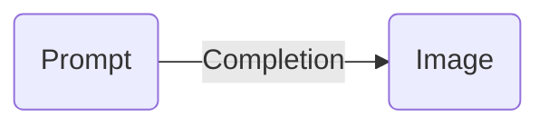
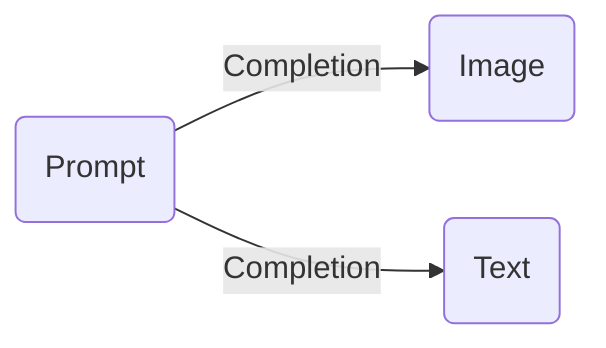
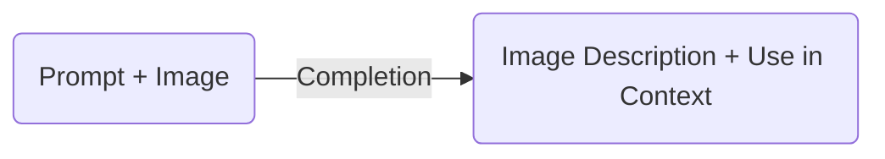

# Azure OpenAI and AI Vision Services

## OpenAI models that can generate images

### DALL-E (2/3)

- Creating images from scratch based on a text prompt (DALL·E 3 and DALL·E 2)
- Creating edited versions of images by having the model replace some areas of a pre-existing image, based on a new text prompt (DALL·E 2 only)
- Creating variations of an existing image (DALL·E 2 only)

Scenario:

- User provides a Prompt and the model generates an image.

Sample:

- [DALL-E 3 - Image Generation](https://github.com/msalemor/llm-use-cases/blob/main/notebooks/dalle-image.ipynb)

### Assistants

Assistants can generate:

- Images
- Data files (e.g. a csv file with data generated by the Assistant)

Supported models:

- GPT 3.5, 4, 4 Turbo, 4 Vision

Sample:

- [Personal Finance](https://github.com/Azure/AI-in-a-Box/blob/main/gen-ai/Assistants/api-in-a-box/personal_finance/assistant-personal_finance.ipynb)

#### Scenario

- User requests a chart of a mathematical equation or bar chart of revenue by region.

## OpenAI model that can describe images and use as Context

- GPT 4 with vision

#### Scenario

- Upload an image
- Describe what is on the image
- Use the image description as context

Image Support:

- PNG (.png), JPEG (.jpeg and .jpg), WEBP (.webp), and non-animated GIF (.gif).

Samples:

- [Compute Selection](https://github.com/msalemor/llm-use-cases/blob/main/notebooks/compute-selection-vision.ipynb)
- [Generate Bicep Code](https://github.com/msalemor/llm-use-cases/blob/main/notebooks/generate-bicep-vision.ipynb)

## Azure AI Vision

| Service | Description |
| ------- | ----------- |
| Optical Character Recognition (OCR) | The OCR service is designed to extract text from images. With the Read API, you can easily extract both printed and handwritten text from photos and documents. This API utilizes advanced deep-learning models and is capable of working with text on different surfaces and backgrounds. It can handle a wide range of materials such as business documents, invoices, receipts, posters, business cards, letters, and whiteboards. Additionally, the OCR APIs support the extraction of printed text in multiple languages. |
| Image Analysis | The Image Analysis service can identify various visual elements in images, including objects, faces, explicit content, and automatically generated text descriptions. |
| Face | The Face service offers artificial intelligence algorithms that can identify, detect, and analyze human faces in pictures. Facial recognition software plays a crucial role in various situations, including identification, touchless access control, and protecting privacy by blurring faces. |
| Video | Video Analysis involves various features related to videos, such as Spatial Analysis and Video Retrieval. Spatial Analysis examines the existence and motion of individuals within a video stream, generating events that can be utilized by other systems for response. |

**Note:** recommended for real-time image processing

#### Scenario

- Extract faces or items from a video

Examples:

- [GPT Video Analysis](https://github.com/Azure/AI-in-a-Box/tree/main/ai-services/gpt-video-analysis-in-a-box)
