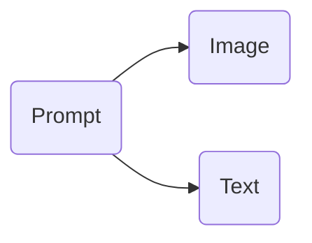

# Azure OpenAI and AI Vision Services

## OpenAI Models that can generate images

### DALL-E (2/3)

- Creating images from scratch based on a text prompt (DALL·E 3 and DALL·E 2)
- Creating edited versions of images by having the model replace some areas of a pre-existing image, based on a new text prompt (DALL·E 2 only)
- Creating variations of an existing image (DALL·E 2 only)

Scenario:

- User provides a Prompt and the model generates an image.

### Assistants

Assistants can generate:

- Images
- Data files (e.g. a csv file with data generated by the Assistant)

#### Scenario

- User requests a chart of a mathematical equation or bar chart of revenue by region.

## OpenAI Models that can analyze images

- GPT 4 with vision

#### Scenario

- Upload an image
- Describe what is on the image
- Use the image description as context

Image Support:

- PNG (.png), JPEG (.jpeg and .jpg), WEBP (.webp), and non-animated GIF (.gif).

## Azure AI Vision

| Service | Description |
| ------- | ----------- |
| Optical Character Recognition (OCR) | The Optical Character Recognition (OCR) service extracts text from images. You can use the new Read API to extract printed and handwritten text from photos and documents. It uses deep-learning-based models and works with text on various surfaces and backgrounds. These include business documents, invoices, receipts, posters, business cards, letters, and whiteboards. The OCR APIs support extracting printed text in several languages. Follow the OCR quickstart to get started. |
| Image Analysis | The Image Analysis service extracts many visual features from images, such as objects, faces, adult content, and auto-generated text descriptions. Follow the Image Analysis quickstart to get started. |
| Face | The Face service provides AI algorithms that detect, recognize, and analyze human faces in images. Facial recognition software is important in many different scenarios, such as identification, touchless access control, and face blurring for privacy. Follow the Face quickstart to get started. |
| Video | Analysis Video Analysis includes video-related features like Spatial Analysis and Video Retrieval. Spatial Analysis analyzes the presence and movement of people on a video feed and produces events that other systems can respond to. Install the Spatial Analysis container to get started. Video Retrieval lets you create an index of videos that you can search with natural language. |

**Note:** recommended for real-time image processing

#### Scenario

- Extract faces or items from a video
